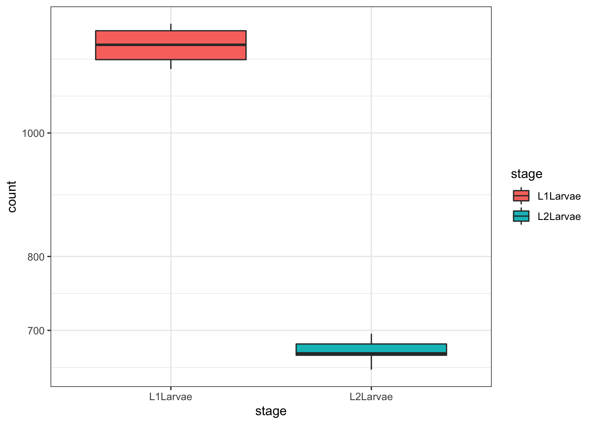
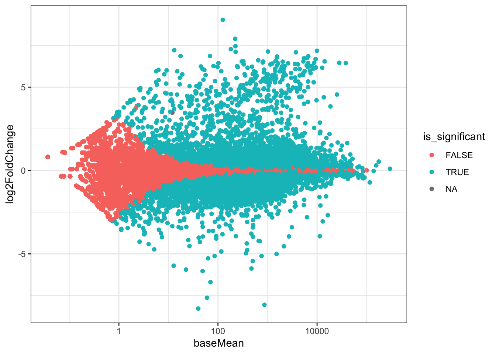
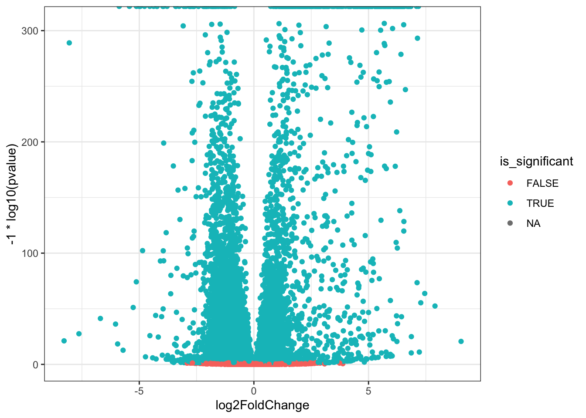

# Quantitative RNA-seq

To perform a quantitative RNAseq analysis, I will be using the following packages to be able to answer which transcripts are differentially expressed:

- _edgeR_ and _DESeq2_ for estimating differential expression
- _GRanges_ to find unannotated transcribed regions
- _bumphunter_ for finding regions with high expression
- differential peak analysis
- _SVA_ for estimating batch effects
- _AllelicImbalance_ for finding allele-specific expression
- plots and RNAseq data presentation

Below are the packages that I will need:

- _AllelicImbalance, bumphunter, csaw, DESeq, edgeR, IRanges, Rsamtools, rtracklayer, sva, SummarizedExperiment, VariantAnnotation_ from _Bioconductor_
- dplyr
- extRemes
- forcats
- magrittr
- readr

# Estimating Differential Expression with _edgeR_

```{r message=FALSE, warning=FALSE}
# load packages
library(edgeR)
library(readr)
library(magrittr)
library(Biobase)
```

## Using _edgeR_ from a count table

```{r}
# load the count data from a TXT file
count_dataframe <- read_tsv( "modencodefly_count_table.txt")
genes <- count_dataframe[["gene"]]
count_dataframe[["gene"]] <- NULL
count_matrix <- as.matrix(count_dataframe)
rownames(count_matrix) <- genes
# load the phenotype data
pheno_data <- read_table2("modencodefly_phenodata.txt")
```

```{r}
# specify experiments of interest
experiments_of_interest <- c("L1Larvae", "L2Larvae")
columns_of_interest <- which(pheno_data$stage %in% experiments_of_interest)
```

```{r}
# form the grouping factor
library(forcats)
grouping <- pheno_data$stage[columns_of_interest] %>% as_factor()
```

```{r}
# form the subset of count data
counts_of_interest <- count_matrix[, columns_of_interest]
```

```{r}
# create the DGE object
count_dge <- DGEList(counts = counts_of_interest, group = grouping)
```

Now, I will perform differential expression analysis:

```{r}
# differential expression analysis
design <- model.matrix(~ grouping)
eset_dge <- estimateDisp(count_dge, design)
# model fit
fit <- glmQLFit(eset_dge, design)
result <- glmQLFTest(fit, coef = 2)
topTags(result)
```
```{r}
## Coefficient:  groupingL2Larvae 
##                logFC    logCPM        F       PValue          FDR
## FBgn0027527 6.318665 11.148756 42854.72 1.132951e-41 1.684584e-37
## FBgn0037424 6.417770  9.715826 33791.15 2.152507e-40 1.518091e-36
## FBgn0037430 6.557774  9.109132 32483.00 3.510727e-40 1.518091e-36
## FBgn0037414 6.337846 10.704514 32088.92 4.083908e-40 1.518091e-36
## FBgn0029807 6.334590  9.008720 27648.19 2.585312e-39 7.688200e-36
## FBgn0037224 7.055635  9.195077 24593.62 1.102456e-38 2.732070e-35
## FBgn0037429 6.623619  8.525136 24122.44 1.400960e-38 2.975840e-35
## FBgn0030340 6.176390  8.500866 23111.55 2.380783e-38 4.424983e-35
## FBgn0029716 5.167089  8.977840 22556.01 3.218122e-38 5.316695e-35
## FBgn0243586 6.966873  7.769756 21465.47 5.945208e-38 8.839930e-35
```


## Using _edgeR_ from an _ExpressionSet_ object

```{r message=FALSE, warning=FALSE}
# load data
load("modencodefly_eset.RData")
```

```{r}
# specify the experiments of interest
experiments_of_interest <- c("L1Larvae", "L2Larvae")
columns_of_interest <- which(pheno_data$stage %in% experiments_of_interest)
```

```{r}
# form the grouping factor
grouping <- droplevels(phenoData(modencodefly.eset)[["stage"]][columns_of_interest])
```

```{r}
# form the subset of count data
counts_of_interest <- exprs(modencodefly.eset)[, columns_of_interest]
```

```{r}
# create the DGE object
eset_dge <- DGEList(counts = counts_of_interest, group = grouping)
```

```{r}
# perform differential expression analysis
design <- model.matrix(~ grouping)
eset_dge <- estimateDisp(count_dge, design)

# model fit
fit <- glmQLFit(eset_dge, design)
result <- glmQLFTest(fit, coef = 2)
topTags(result)
```
```{r}
## Coefficient:  groupingL2Larvae 
##                logFC    logCPM        F       PValue          FDR
## FBgn0027527 6.318665 11.148756 42854.72 1.132951e-41 1.684584e-37
## FBgn0037424 6.417770  9.715826 33791.15 2.152507e-40 1.518091e-36
## FBgn0037430 6.557774  9.109132 32483.00 3.510727e-40 1.518091e-36
## FBgn0037414 6.337846 10.704514 32088.92 4.083908e-40 1.518091e-36
## FBgn0029807 6.334590  9.008720 27648.19 2.585312e-39 7.688200e-36
## FBgn0037224 7.055635  9.195077 24593.62 1.102456e-38 2.732070e-35
## FBgn0037429 6.623619  8.525136 24122.44 1.400960e-38 2.975840e-35
## FBgn0030340 6.176390  8.500866 23111.55 2.380783e-38 4.424983e-35
## FBgn0029716 5.167089  8.977840 22556.01 3.218122e-38 5.316695e-35
## FBgn0243586 6.966873  7.769756 21465.47 5.945208e-38 8.839930e-35
```

# Estimating Differential Expression with _DESeq2_

This package uses dispersion estimates and relative expression changes to strengthen estimates and modeling with an emphasis on improving gene ranking in result tables. Contrary to _edgeR_, _DESeq2_ uses a geometric style normalisation in which the per lane scaling factor is computed as the median of the ratios of the gene count over its geometric mean ration, whereas _edgeR_ uses the weighted one.

```{r}
# load packages
library(readr)
library(magrittr)
library(SummarizedExperiment)
library(DESeq2)
```

## Using _DESeq2_ from an _ExpressionSet_ object

```{r}
# load data
load("modencodefly_eset.RData")

# convert into DESeqDataSet
summ_exp <- makeSummarizedExperimentFromExpressionSet(modencodefly.eset)
ddsSE <- DESeqDataSet(summ_exp, design = ~ stage)
```

```{r}
ddsSE <- DESeq(ddsSE)
resSE <- results(ddsSE, contrast = c("stage", "L2Larvae", "L1Larvae"))
```

# Differential Peak Analysis

When unannotated transcript are discovered, I will check whether they are differentially expressed between experiments.

```{r}
# load packages
library(SummarizedExperiment)
```

```{r}
# load data
arab_rse <- readRDS("arabidopsis_rse.RDS")

# set up a function to create region tags
make_tag <- function(grange_obj){
  paste0(
    grange_obj@seqnames,
    ":",
    grange_obj@ranges@start,
    "-",
    (grange_obj@ranges@start + grange_obj@ranges@width)
  )
}
```

Pull out the actual data from _RangedSummarizedExperiment_ using the _assay()_ function.

```{r}
# extract data
counts <- assay(arab_rse)

# annotate rows
if (! is.null(names(rowRanges(arab_rse)))){
  rownames(counts) <- names(rowRanges(arab_rse))
} else {
  rownames(counts) <- make_tag(rowRanges(arab_rse))
}
```

# Estimating Batch Effects using _SVA_

High-throughput data like RNA-seq is often fashioned by technical errors that are not explicitly modelled in the experimental design, therefore, confound the detection of differential expression. This technical error should be modelled in the experimental design. For this reason, _surrogate variable_ tables are used to explain the batch effects and take it into account in the modelling and differential expression analysis.

```{r}
# load packages
library(sva)

# data
arab <- readRDS("arabidopsis.RDS")
```

```{r}
# filter out rows with too few counts
keep <- apply(arab, 1, function(x){length(x[x > 3]) >= 2})
arab_filtered <- arab[keep, ]
```

```{r}
# create the initial design
groups <- as.factor(rep(c("mock", "hrcc"), each = 3))
```

```{r}
# set up the null and alternative hypothesis
test_model <- model.matrix(~groups)
null_model <- test_model[, 1]

# run SVA
svar <- svaseq(arab_filtered,
               test_model,
               null_model,
               n.sv = 1)
```

```{r}
# extract SVA
design <- cbind(test_model, svar$sv)
```

# Finding Allele-specific Expressions with AllelicImbalance

When there is a differential abundance of different allelic variants of a transcript, it is called an allele-specific expression. By using RNA-seq data, one would be able to estimate allele-specific expression for genes with polymorphisms.

```{r}
# load packages
library(AllelicImbalance)
library(VariantAnnotation)
```

```{r}
# create a GRanges object
region_of_interest <- GRanges(seqnames = c("17"), ranges = IRanges(79478301, 79478361))

# set up an import folder
bam_folder <- "allele_expression"

# load reads and variants in regions of interests
reads <- impBamGAL(bam_folder, region_of_interest, verbose = FALSE)

vcf_file <- "allele_expression/ERP000101.vcf"
variant_positions <- granges(VariantAnnotation::readVcf(vcf_file), "hg19")

allele_counts <- getAlleleCounts(reads, variant_positions, verbose = FALSE)
```

```{r}
# build the ASEset object
ase.vcf <- ASEsetFromCountList(rowRanges = variant_positions, allele_counts)
reference_sequence <- "allele_expression/hg19.chr17.subset.fa"
ref(ase.vcf) <- refAllele(ase.vcf, fasta = reference_sequence) # reference base identity
alt(ase.vcf) <- inferAltAllele(ase.vcf) # alternative base identity
```

```{r}
# run the test on all variants
binom.test(ase.vcf, n = "*")
```

# Plotting and Presenting RNA-seq Data

```{r}
# load packages
library(DESeq2)
library(ggplot2)
library(magrittr)
library(dplyr)
```

```{r}
# create dataframe
dds <- readRDS("modencode_dds.RDS")
```

```{r}
# create a boxplot of counts for a single gene
plotCounts(dds,
           gene = "FBgn0000014",
           intgroup = "stage",
           returnData = TRUE) %>%
  ggplot() + aes(stage, count) + geom_boxplot(aes(fill = stage)) +
  scale_y_log10() + theme_bw()
```



```{r}
# create an MA plot with colouring conditioned on significance
result_df <- results(dds, contrast = c("stage", "L2Larvae", "L1Larvae"), tidy = TRUE) %>%
  mutate(is_significant = padj < 0.05)

ggplot(result_df) + aes(baseMean, log2FoldChange) +
  geom_point(aes(colour = is_significant)) +
  scale_x_log10() +
  theme_bw()
```


```{r}
# create a volcano plot with colouring conditioned on significance
ggplot(result_df) +
  aes(log2FoldChange, -1 * log10(pvalue)) +
  geom_point(aes(colour=is_significant)) +
  theme_bw()
```


```{r session info}
sessionInfo()
```
```{r}
## R version 4.0.1 (2020-06-06)
## Platform: x86_64-apple-darwin17.0 (64-bit)
## Running under: macOS Catalina 10.15.6
## 
## Matrix products: default
## BLAS:   /Library/Frameworks/R.framework/Versions/4.0/Resources/lib/libRblas.dylib
## LAPACK: /Library/Frameworks/R.framework/Versions/4.0/Resources/lib/libRlapack.dylib
## 
## locale:
## [1] en_GB.UTF-8/en_GB.UTF-8/en_GB.UTF-8/C/en_GB.UTF-8/en_GB.UTF-8
## 
## attached base packages:
##  [1] grid      stats4    parallel  stats     graphics  grDevices utils    
##  [8] datasets  methods   base     
## 
## other attached packages:
##  [1] dplyr_1.0.2                 ggplot2_3.3.2              
##  [3] VariantAnnotation_1.34.0    AllelicImbalance_1.26.0    
##  [5] GenomicAlignments_1.24.0    Rsamtools_2.4.0            
##  [7] Biostrings_2.56.0           XVector_0.28.0             
##  [9] sva_3.36.0                  BiocParallel_1.22.0        
## [11] genefilter_1.70.0           mgcv_1.8-33                
## [13] nlme_3.1-149                DESeq2_1.28.1              
## [15] SummarizedExperiment_1.18.2 DelayedArray_0.14.1        
## [17] matrixStats_0.56.0          GenomicRanges_1.40.0       
## [19] GenomeInfoDb_1.24.2         IRanges_2.22.2             
## [21] S4Vectors_0.26.1            forcats_0.5.0              
## [23] Biobase_2.48.0              BiocGenerics_0.34.0        
## [25] magrittr_1.5                readr_1.3.1                
## [27] edgeR_3.30.3                limma_3.44.3               
## 
## loaded via a namespace (and not attached):
##  [1] colorspace_1.4-1        seqinr_3.6-1            ellipsis_0.3.1         
##  [4] biovizBase_1.36.0       htmlTable_2.0.1         base64enc_0.1-3        
##  [7] dichromat_2.0-0         rstudioapi_0.11         farver_2.0.3           
## [10] bit64_4.0.5             AnnotationDbi_1.50.3    splines_4.0.1          
## [13] geneplotter_1.66.0      knitr_1.29              ade4_1.7-15            
## [16] Formula_1.2-3           annotate_1.66.0         cluster_2.1.0          
## [19] dbplyr_1.4.4            png_0.1-7               compiler_4.0.1         
## [22] httr_1.4.2              backports_1.1.9         assertthat_0.2.1       
## [25] Matrix_1.2-18           lazyeval_0.2.2          htmltools_0.5.0        
## [28] prettyunits_1.1.1       tools_4.0.1             gtable_0.3.0           
## [31] glue_1.4.2              GenomeInfoDbData_1.2.3  rappdirs_0.3.1         
## [34] Rcpp_1.0.5              vctrs_0.3.4             rtracklayer_1.48.0     
## [37] xfun_0.16               stringr_1.4.0           lifecycle_0.2.0        
## [40] ensembldb_2.12.1        XML_3.99-0.5            MASS_7.3-52            
## [43] zlibbioc_1.34.0         scales_1.1.1            BSgenome_1.56.0        
## [46] ProtGenerics_1.20.0     hms_0.5.3               AnnotationFilter_1.12.0
## [49] RColorBrewer_1.1-2      yaml_2.2.1              curl_4.3               
## [52] memoise_1.1.0           gridExtra_2.3           biomaRt_2.44.1         
## [55] rpart_4.1-15            latticeExtra_0.6-29     stringi_1.4.6          
## [58] RSQLite_2.2.0           checkmate_2.0.0         GenomicFeatures_1.40.1 
## [61] rlang_0.4.7             pkgconfig_2.0.3         bitops_1.0-6           
## [64] evaluate_0.14           lattice_0.20-41         purrr_0.3.4            
## [67] labeling_0.3            htmlwidgets_1.5.1       bit_4.0.4              
## [70] tidyselect_1.1.0        R6_2.4.1                generics_0.0.2         
## [73] Hmisc_4.4-1             DBI_1.1.0               withr_2.2.0            
## [76] pillar_1.4.6            foreign_0.8-80          survival_3.2-3         
## [79] RCurl_1.98-1.2          nnet_7.3-14             tibble_3.0.3           
## [82] crayon_1.3.4            BiocFileCache_1.12.1    rmarkdown_2.3          
## [85] jpeg_0.1-8.1            progress_1.2.2          locfit_1.5-9.4         
## [88] data.table_1.13.0       blob_1.2.1              digest_0.6.25          
## [91] xtable_1.8-4            openssl_1.4.2           munsell_0.5.0          
## [94] Gviz_1.32.0             askpass_1.1
```
